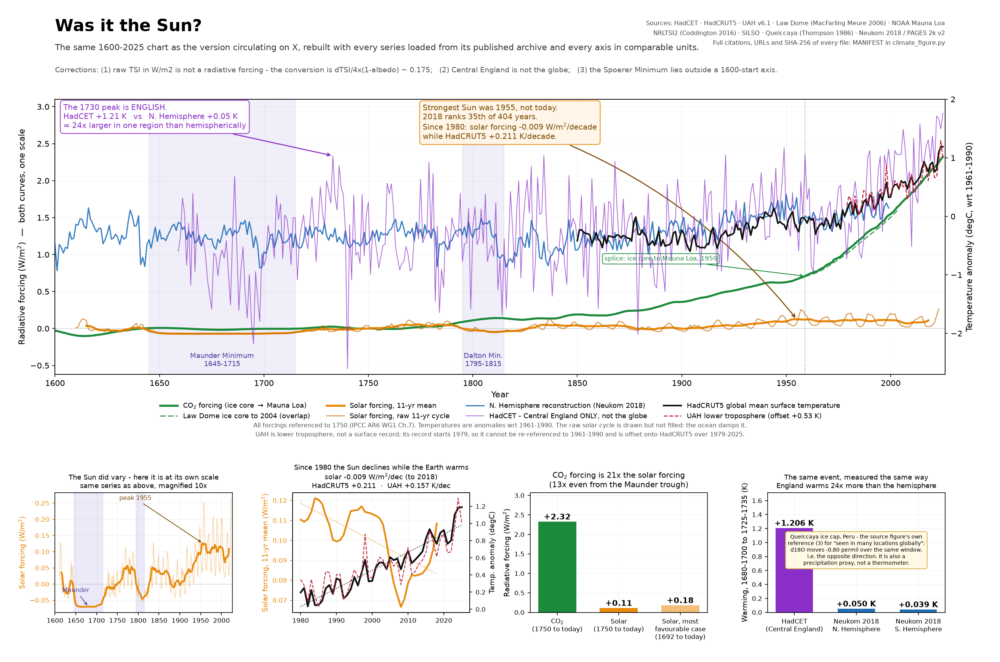

# Was it the Sun?

A reproducible rebuild of a climate figure circulating on X which argues that the
warming since the Little Ice Age is solar in origin.

The rebuild keeps the original's visual architecture — one wide panel, 1600–2025,
solar-minimum shading, annotated turning points — so the two can be read side by
side. What changes is the parts that were wrong.



## What the original gets wrong

**1. Raw TSI is plotted as if it were a radiative forcing.** Total solar irradiance
in W/m² at the top of the atmosphere is not a forcing. The Sun illuminates a
cross-section πr² while the Earth radiates from 4πr², and about 30 % is reflected,
so the conversion is `ΔTSI/4 × (1−α) ≈ 0.175`. Skipping it overstates the solar
term by a factor of ~5.7 on geometry alone. Scaling the solar axis to the 11-year
cycle peaks compounds it.

**2. HadCET is presented as a global record.** The sharp warming around 1730 is a
Central England signal. Measured identically — mean of 1680–1700 against mean of
1725–1735 — England warms **24× more** than the Northern Hemisphere.

**3. The Spörer Minimum (~1460–1550) is labelled on an axis that starts in 1600,**
roughly 150 years from the period it names.

## What this repository finds

All values are computed by the pipeline; none are typed in.

| | |
|---|---|
| CO₂ forcing, 1750→today | **+2.32 W/m²** |
| Solar forcing, 1750→today | **+0.11 W/m²** |
| Ratio | **21 : 1** |
| Ratio, measured from the Maunder trough (1692) | **13 : 1** |
| Solar forcing trend since 1980 | **−0.009 W/m²/decade** |
| HadCRUT5 trend since 1980 | **+0.211 K/decade** |
| UAH lower-troposphere trend since 1980 | **+0.157 K/decade** |
| Warming 1680–1700 → 1725–1735, HadCET | **+1.206 K** |
| …same window, N. Hemisphere reconstruction | **+0.050 K** |
| …same window, S. Hemisphere reconstruction | **+0.039 K** |

Two results carry most of the weight:

**The Sun and the Earth have moved in opposite directions since 1980.** No choice of
axis can repair a disagreement in sign. The strongest 11-year mean TSI in the record
is **1955**, not today; 2018 ranks 35th of 404 years.

**The source figure's own reference (3) contradicts it.** Thompson et al. (1986),
the Quelccaya ice cap in Peru, is cited there for "seen in many locations globally".
Over the same 1680–1700 → 1725–1735 window its δ¹⁸O moves −0.80 ‰ — the opposite
direction — and Central England correlates with it at r = −0.02 (annual) over
1659–1800. The paper's own abstract highlights 1590–1630, 1800–1840 and 1915–1940,
not 1690–1730. It is also a precipitation-influenced proxy, not a thermometer, so on
a correct reading it cannot support a temperature claim at all.

## Reproducing it

```bash
pip install -r requirements.txt
python fetch_data.py
python climate_figure.py
```

Exit code 0 with `figure_climate_1600_2025.png` written means every series passed
validation. Exit code 1 means one failed — read stderr and fix the data or the
config; do not weaken the check.

```bash
python robustness.py
```

prints the sensitivity of the CO₂:solar ratio to albedo, to the reference year, and
to skipping the geometric conversion altogether, plus a cross-check of the CO₂
forcing against IPCC AR6.

## How it is kept honest

`data/` is not committed; `fetch_data.py` downloads the exact files in the MANIFEST.
Every series carries a MANIFEST entry with citation, URL, access date and SHA-256,
and an `EXPECT` entry checked before anything is plotted:

- **sha256** of the raw file — a wrong file spanning the right years passes a year
  check in silence
- **coverage** — first and last year
- **value_range** — catches unit errors and column mix-ups
- **n_min** — catches a file that parsed into mostly NaN
- **column names** — asserted against the real file header, so `CFG` cannot drift
  into documentation

MANIFEST completeness is enforced in code: an undocumented series or an orphan entry
raises `DataError`. A QC table prints for every series before any figure is written.

The rules the pipeline is held to are in [AGENTS.md](AGENTS.md), and they apply to
this figure too. Notably: if this figure drew the solar term smaller than its
computed forcing warrants, that would be the same error as the original with the
sign reversed. The solar series therefore also appears at its own scale, with the
magnification stated, so its real structure — the Maunder dip, Dalton, the 1955 peak
— stays visible.

## Sources

HadCET (Manley 1974; Parker et al. 1992) · HadCRUT5 (Morice et al. 2021) ·
UAH v6.1 (Spencer, Christy & Braswell 2017) · Law Dome CO₂ (MacFarling Meure et al.
2006) · NOAA GML Mauna Loa · NRLTSI2 (Coddington et al. 2016) · SILSO v2.0 ·
Quelccaya (Thompson et al. 1986) · Neukom et al. 2018 hemispheric reconstructions
from PAGES 2k v2.0.0 proxies.

Full citations, URLs, access dates and file hashes: the MANIFEST block at the top of
[climate_figure.py](climate_figure.py).

GloSAT is deliberately not used — it requires a free CEDA account. The global series
here is HadCRUT5 and is labelled HadCRUT5.
